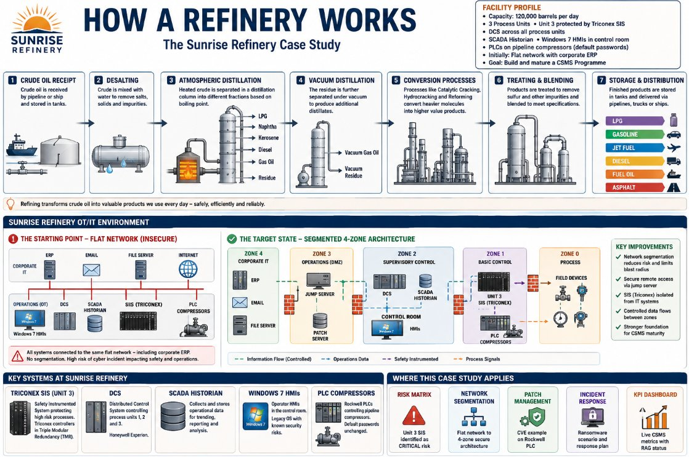

# OpenCSMS — Open Source IACS Cyber Security Management System

**A free, complete, practitioner-built CSMS framework for Industrial Automation and Control Systems, aligned to IEC 62443-2-1:2010.**

[](https://creativecommons.org/licenses/by/4.0/)
[](https://www.iec.ch/iec62443)
[]()
[]()

---

## What Is This?

**OpenCSMS** is a fully open source Cyber Security Management System (CSMS) framework built specifically for **Operational Technology (OT) and Industrial Automation and Control System (IACS) environments**. It gives engineers, security practitioners, and operations teams everything they need to establish, operate, and sustain a structured cyber security programme — without paying for expensive consultants or proprietary frameworks.

Everything in this project is built directly from **IEC 62443-2-1:2010**, the international standard for establishing an IACS security programme. Every document, template, and training resource maps to a specific clause. Nothing is made up.

This is not a sales pitch. It is not a marketing framework. It is a practitioner-built toolkit for people who need to actually get a CSMS working — in a refinery, a water treatment plant, a power station, a chemical facility, or any other environment where a cyber incident could hurt people, not just data.

---

## Why This Exists

Most organisations that operate IACS know they need to improve their cyber security posture. Most of them also face the same three obstacles:

**1. The standard is expensive and dense.**
IEC 62443-2-1 is a 342-page technical standard that costs money to obtain and requires significant expertise to interpret. The gap between "we need a CSMS" and "we know how to build one" is enormous for most OT teams.

**2. Commercial solutions are out of reach.**
Vendor-led CSMS programmes and consulting engagements are expensive. Smaller operators — community water systems, regional power networks, mid-sized manufacturers — cannot afford them. Their IACS is just as critical as a major operator's.

**3. IT security frameworks don't translate.**
ISO 27001, NIST CSF, and standard IT security frameworks require significant adaptation for OT contexts. Account lockouts that are safe in IT can be catastrophic in a control room. Patch cycles that are routine for enterprise systems can require months of planning for a live process. The OT context is different, and most freely available resources don't acknowledge that.

**OpenCSMS exists to close that gap.** If you operate IACS and you need a structured, standards-aligned cyber security programme, this project gives you everything you need to build one — for free.

---

## Who This Is For

| Audience | How This Helps |
|---|---|
| **OT / Control System Engineers** | Understand what a CSMS is, why it matters, and how to build one without starting from scratch |
| **OT Security Practitioners** | Complete, auditable document templates covering every SHALL requirement — no blank page problem |
| **IT Risk Professionals entering OT** | Dedicated training on why IT risk methodologies fail in OT, and how to select and apply the right methods |
| **Plant / Operations Managers** | Plain-language training materials and a management commitment framework you can actually use |
| **Compliance and Audit Teams** | Standards-mapped documents with clause references on every page — built for audit evidence |
| **Smaller Operators** | A professional-grade CSMS programme that doesn't require a six-figure consulting engagement |
| **Universities and Training Organisations** | A structured, real-world curriculum for industrial cyber security education |
| **Security Researchers** | An open platform to study CSMS implementation patterns in OT environments |

---

## What's in This Repository

The project is organised into three layers: **Learn**, **Build**, and **Operate**.

```
OpenCSMS/
│
├── 📚 training/
│   │
│   ├── csms-foundations/
│   │   ├── IEC62443_2_1_CSMS_Complete_Training.pptx     ← 33-slide CSMS mastery deck (Stages 1–5)
│   │   └── IEC62443-2-1_Learning_Roadmap.html            ← Interactive 5-stage learning roadmap
│   │
│   └── risk-methodology/
│       ├── OT_Risk_Methodology_Training.html             ← Interactive 6-stage methodology training
│       └── OT_Risk_Methodology_Training.pptx             ← 25-slide methodology deep-dive deck
│
├── 📄 templates/
│   ├── risk-analysis/                                    ← Category 1: Risk Analysis (10 docs)
│   │   ├── CSMS-RA-001_Methodology_Selection.docx
│   │   ├── CSMS-RA-002_IACS_Asset_Inventory.docx
│   │   ├── CSMS-RA-003_Network_Diagrams_Register.docx
│   │   ├── CSMS-RA-004_System_Prioritisation.docx
│   │   ├── CSMS-RA-005_HighLevel_Risk_Assessment.docx
│   │   ├── CSMS-RA-006_Detailed_Vulnerability_Assessment.docx
│   │   ├── CSMS-RA-007_Detailed_Risk_Assessment.docx
│   │   ├── CSMS-RA-008_Risk_Register.docx
│   │   ├── CSMS-RA-009_Reassessment_Trigger_Register.docx
│   │   └── CSMS-RA-010_Vulnerability_Assessment_Records.docx
│   │
│   └── policy-org-awareness/                             ← Category 2a: Policy, Org & Awareness (13 docs)
│       ├── CSMS-POA-001_CSMS_Scope_Document.docx
│       ├── CSMS-POA-002_Management_Commitment_Statement.docx
│       ├── CSMS-POA-003_Security_Organisation_Responsibilities.docx
│       ├── CSMS-POA-004_Training_Programme.docx
│       ├── CSMS-POA-005_Training_Revision_Procedure.docx
│       ├── CSMS-POA-006_Training_Completion_Records.docx
│       ├── CSMS-POA-007_Business_Continuity_Plan.docx
│       ├── CSMS-POA-008_Backup_Restore_Procedures.docx
│       ├── CSMS-POA-009_BCP_Test_Records.docx
│       ├── CSMS-POA-010_HighLevel_Security_Policy.docx
│       ├── CSMS-POA-011_Procedures_Register.docx
│       ├── CSMS-POA-012_Risk_Tolerance_Statement.docx
│       └── CSMS-POA-013_Policy_Communication_Review_Records.docx
│
└── README.md                                             ← You are here
```

> **More templates are coming.** The remaining SHALL documents covering Selected Security Countermeasures (14 docs) and Implementation (17 docs) are in active development. See the [Roadmap](#roadmap) section.

---

## The Three-Layer Structure

### Layer 1 — Learn 📚

Before building a CSMS, you need to understand one. The training layer gives you that foundation. It now contains two distinct training programmes: one covering the full CSMS, and a dedicated module on risk assessment methodology selection — a topic that consistently trips up teams transitioning from IT risk backgrounds.

---

#### 1a. CSMS Foundations Training

**`training/csms-foundations/IEC62443_2_1_CSMS_Complete_Training.pptx`** — A 33-slide PowerPoint training deck covering all five stages of CSMS mastery. Built by a practitioner with 25+ years of OT security teaching experience. Every slide uses a consistent fictional case study — **Sunrise Refinery** (a 120,000 bbl/day oil refinery with real-world IACS configurations including an exposed Triconex SIS, unpatched Windows 7 HMIs, and a SCADA historian reachable from the corporate LAN) — to ground abstract concepts in operational reality.

| Stage | Slides | Content |
|---|---|---|
| Stage 1 | 3–9 | IACS vs IT security, 3-category CSMS architecture, SHALL vs SHOULD, Annex B 6-step process, key terminology |
| Stage 2 | 10–15 | Risk assessment methodology, building the risk matrix, scoring the risk register, reassessment triggers |
| Stage 3 | 16–21 | Network segmentation (zone architecture), access control (3 elements), training programme design |
| Stage 4 | 22–26 | Change management, patch management, incident response (3 phases) |
| Stage 5 | 27–33 | Conformance audits, KPI dashboards, autonomous CSMS operation |

**`training/csms-foundations/IEC62443-2-1_Learning_Roadmap.html`** — An interactive browser-based roadmap that walks you through all five stages with clickable navigation, colour-coded requirement types (SHALL vs SHOULD), practical checklists, and stage completion gates. Open it locally — no server required.

---

#### 1b. Risk Assessment Methodology Training

A dedicated training programme specifically for teams — particularly IT risk professionals — who need to understand which risk assessment methodologies are fit for purpose in OT environments, and how to apply them correctly. This is a common and consequential gap: an IT risk team applying ISO 27005 to a safety-critical IACS will systematically underestimate risk and recommend controls that create new hazards.

**`training/risk-methodology/OT_Risk_Methodology_Training.html`** — A self-contained interactive training module (~3.5 hours). Open in any browser with no server or internet connection required. Covers six stages:

| Stage | Duration | Content |
|---|---|---|
| Stage 1: OT vs IT Risk Fundamentals | 45 min | Why IT risk tools fail in OT. The three OT risk domains. Why ISO 27005 systematically underestimates IACS risk. The IEC 62443 risk model and the mandatory §4.2 sequence. |
| Stage 2: The 5 Methodologies | 90 min | Deep dive on each method: IEC 62443 Risk Matrix, HAZOP/LOPA, STRIDE, Bow-Tie, NIST SP 800-82. Strengths, weaknesses, and worked OT examples for each. |
| Stage 3: The Decision Matrix | 30 min | Interactive methodology decision matrix. Select the system type being assessed and the matrix re-ranks and explains the recommended primary and supporting methods — with rationale text formatted for direct use in CSMS-RA-001. |
| Stage 4: Worked Examples | 60 min | Two complete end-to-end assessments: (1) LAN-connected Triconex SIS at Sunrise Refinery — from discovery through HAZOP consequence analysis, IEC 62443 scoring (Score 16, CRITICAL), to SL-T 3 countermeasures. (2) IGV navigation at a DP World-type automated terminal — STRIDE-first assessment through V2X threat enumeration, producing three CRITICAL risks. |
| Stage 5: Application & Mastery | 30 min | The 7 principles of OT risk assessment. Quick-reference methodology table. Interactive CSMS-RA-001 audit checklist. |
| Knowledge Check | — | 8 practitioner-level questions covering all five stages, with detailed feedback explaining the OT-specific reasoning behind each answer. |

**`training/risk-methodology/OT_Risk_Methodology_Training.pptx`** — A 25-slide PowerPoint deck that mirrors the HTML training module, designed for classroom and workshop delivery. Same content, same case studies, built for facilitated group training.

| Slides | Stage | Highlights |
|---|---|---|
| 3–6 | OT vs IT Fundamentals | 7-dimension comparison table with danger cells highlighted; ISO 27005 failure analysis; IEC 62443 §4.2 sequence |
| 7–14 | The 5 Methodologies | One deep-dive slide per methodology; worked HAZOP guide-word table; full STRIDE table on IGV V2X; visual Bow-Tie diagram with barrier gap analysis |
| 15–17 | Decision Matrix | 9×5 scored matrix with primary recommendations highlighted; hybrid combinations by industry sector |
| 18–20 | Worked Examples | Triconex SIS 4-step walk-through; IGV navigation STRIDE-to-scoring assessment |
| 21–25 | Mastery | 7 principles card grid; CSMS-RA-001 audit checklist; quick reference table; IT→OT mindset shift |

**The interactive methodology decision matrix** is embedded in the HTML module and covers 10 system types against 5 methodologies across 8 scoring dimensions:

| System Type | Recommended Primary | Supporting |
|---|---|---|
| Safety systems (SIS/ESD) | IEC 62443 Risk Matrix | HAZOP + LOPA |
| DCS / PLC / RTU | IEC 62443 Risk Matrix | HAZOP |
| SCADA / Historian | IEC 62443 Risk Matrix | STRIDE |
| OT network & zones | IEC 62443 Risk Matrix | — |
| AGV / IGV / autonomous | STRIDE | IEC 62443 Risk Matrix |
| TOS / software-intensive | STRIDE | IEC 62443 Risk Matrix |
| Physical / HSE consequence | HAZOP | IEC 62443 Risk Matrix |
| Vendor / supply chain | STRIDE | IEC 62443 Risk Matrix |
| Executive communication | Bow-Tie | IEC 62443 (scores) |

> **For CSMS-RA-001 users:** The decision matrix generates the rationale text required by §4.2.3.1 (SHALL) for your methodology selection record. Select your system type, copy the explanation text, and paste it into Section 4 of the CSMS-RA-001 template.

---

### Layer 2 — Build 📄

The template layer is the core of the project. These are production-ready Word documents — not blank forms. Every template contains:

- **Classification banner** with security handling instructions
- **Document control block** with version, status, owner, and approver fields
- **Clause references** mapped to specific IEC 62443-2-1:2010 requirements on every page
- **Structured sections** with instructional guidance for the person completing the document
- **Pre-populated rows and examples** to eliminate the blank-page problem
- **Callout boxes** highlighting OT-specific considerations that differ from IT security practice
- **Review and approval block** with version history
- **Consistent header/footer** with document reference and page numbers

#### Category 1: Risk Analysis (`templates/risk-analysis/`)

Ten documents covering the mandatory SHALL requirements of §4.2 — the foundational risk analysis category that every CSMS must complete before building any controls.

| Document | Clause | Purpose |
|---|---|---|
| CSMS-RA-001 | §4.2.3.1 | Formal selection and documentation of the risk assessment methodology |
| CSMS-RA-002 | §4.2.3.4 | Complete IACS asset inventory with technical and operational fields |
| CSMS-RA-003 | §4.2.3.5 | Network diagram register with mandatory content checklist and connectivity matrix |
| CSMS-RA-004 | §4.2.3.6 | System prioritisation using weighted criteria — defines assessment sequence |
| CSMS-RA-005 | §4.2.3.3 | High-level risk assessment report — threats, vulnerabilities, consequences |
| CSMS-RA-006 | §4.2.3.7 | Detailed vulnerability assessment across 5 domains per system |
| CSMS-RA-007 | §4.2.3.9 | Detailed risk assessment with L×C scoring, HSE integration, and treatment decisions |
| CSMS-RA-008 | §4.2.3.9/13 | The central risk register — living document with dashboard and acceptance register |
| CSMS-RA-009 | §4.2.3.10 | Reassessment trigger register — the mechanism that makes the CSMS self-correcting |
| CSMS-RA-010 | §4.2.3.13 | Vulnerability assessment lifecycle log — the audit evidence trail |

#### Category 2a: Policy, Organisation & Awareness (`templates/policy-org-awareness/`)

Thirteen documents covering the SHALL requirements of §4.3.2 — the governance and human factors layer that gives the technical CSMS its authority and its people.

| Document | Clause | Purpose |
|---|---|---|
| CSMS-POA-001 | §4.3.2.2.1 | The CSMS scope document — defines the boundary of everything that follows |
| CSMS-POA-002 | §4.3.2.3.1 | Management commitment statement — the executive signature that gives the CSMS authority |
| CSMS-POA-003 | §4.3.2.3.2/.3 | Security organisation and responsibilities — roles, RACI, Steering Committee charter |
| CSMS-POA-004 | §4.3.2.4.1/.2 | Training programme design — role matrix, module specs, onboarding checklist |
| CSMS-POA-005 | §4.3.2.4.5 | Training revision procedure — triggers, process, and revision log |
| CSMS-POA-006 | §4.3.2.4.6 | Training completion records — completion register, compliance dashboard |
| CSMS-POA-007 | §4.3.2.5.3 | IACS business continuity plan — RTO/RPO, manual fallback, recovery sequence |
| CSMS-POA-008 | §4.3.2.5.6 | Backup and restore procedures — OT-specific 5-step process with pre-restore checks |
| CSMS-POA-009 | §4.3.2.5.7 | BCP test records — test programme, findings register, history log |
| CSMS-POA-010 | §4.3.2.6.1/.4/.8 | The high-level IACS cyber security policy — 10 policy statements, risk tolerance, executive sign-off |
| CSMS-POA-011 | §4.3.2.6.2/.4 | Procedures register — the complete cross-referenced index of all CSMS documents |
| CSMS-POA-012 | §4.3.2.6.5 | Risk tolerance statement — signed thresholds defining what the organisation will and will not accept |
| CSMS-POA-013 | §4.3.2.6.6/.7 | Policy communication and review records — evidence that policies reach people and stay current |

---

### Layer 3 — Operate 🔧

*(Coming soon — see Roadmap)*

The operate layer will cover the implementation and monitoring phases: change management, patch management, access control, incident response, conformance auditing, and KPI reporting.

---

## How to Use This Project

### If you're starting a CSMS from scratch

1. **Read the standard.** Obtain a copy of IEC 62443-2-1:2010. This project is a companion to the standard, not a replacement for it.

2. **Work through the CSMS foundations training first.** Open `training/csms-foundations/IEC62443-2-1_Learning_Roadmap.html` in your browser and complete Stage 1 before touching any templates. The CSMS training deck is designed for workshop delivery — use it with your team.

3. **If your team has IT risk backgrounds, complete the methodology training before the risk assessment.** Open `training/risk-methodology/OT_Risk_Methodology_Training.html` and work through Stages 1–3 before starting CSMS-RA-001. The methodology decision matrix in Stage 3 will populate your CSMS-RA-001 rationale directly.

4. **Follow the Annex B sequence.** The templates are numbered to reflect the correct development order. Start with CSMS-POA-001 (Scope), then CSMS-POA-002 (Management Commitment), then CSMS-RA-001 (Methodology Selection), and work forward. Resist the temptation to jump to controls.

5. **Complete templates in order.** Later templates reference earlier ones. The Risk Register (CSMS-RA-008) depends on the Detailed Risk Assessment (CSMS-RA-007), which depends on the Vulnerability Assessment (CSMS-RA-006), which depends on the Asset Inventory (CSMS-RA-002). The sequence exists for a reason.

6. **Fill in the grey italic text.** Every field with grey italic placeholder text is a required input. Fields that say `[Click to complete]` or provide an example in brackets need your organisation-specific content.

7. **Keep records.** Every document has a version history block. Use it. The audit evidence trail you build from day one is what demonstrates programme maturity when a regulator, insurer, or customer asks.

### If you're adding to an existing CSMS

Use the templates as a gap analysis tool. Open each template and compare its sections against your existing documentation. Any section you cannot point to an existing document for is a potential audit finding.

The Procedures Register (CSMS-POA-011) is designed for exactly this purpose — it gives you a complete index of what should exist and lets you map your current documents against it.

### If you're using this for training or education

Both training decks (CSMS foundations and risk methodology) are released under Creative Commons BY 4.0 and can be freely used, adapted, and delivered in training environments. The HTML modules work offline — no server or internet connection required, making them suitable for use in secure OT environments without internet access.

The Sunrise Refinery case study runs consistently through all training materials, making multi-session workshop delivery straightforward: participants encounter the same facility across CSMS foundations training, risk methodology training, and the document templates.

The risk methodology training module is particularly suited to:
- IT security teams being asked to assess or support OT environments for the first time
- Mixed IT/OT teams needing a shared understanding of why OT risk assessment requires a different approach
- University and TAFE courses covering industrial cyber security

---

## The Sunrise Refinery Case Study

All training materials and practical examples throughout this project use a consistent fictional facility — **Sunrise Refinery** — to ground abstract CSMS concepts in operational reality.

**Facility profile:** A crude oil refinery processing 120,000 barrels per day, with a Triconex Safety Instrumented System on Unit 3, a DCS across three process units, a SCADA historian, control room HMIs running Windows 7, pipeline compressor PLCs with unchanged default passwords — and critically, all of this initially connected to the same flat network as the corporate ERP.

This is not an edge case. This is the configuration found in thousands of operating facilities around the world right now. The Sunrise Refinery starts insecure and gets progressively better as the CSMS programme matures — which is exactly how real CSMS programmes work.



*Figure: The Sunrise Refinery case study — showing the refining process, the starting-point flat network (insecure), the target 4-zone segmented architecture, and the key systems (Triconex SIS, DCS, SCADA Historian, Windows 7 HMIs, Rockwell PLCs) used throughout the OpenCSMS training materials and templates.*

The case study appears across all materials:

| Training/Template | Sunrise Refinery appearance |
|---|---|
| CSMS Foundations deck | Risk matrix examples, network segmentation (flat → 4-zone), patch management, incident response, KPI dashboard |
| Risk Methodology HTML/PPTX | SCADA historian risk scoring (worked), LAN-connected Triconex SIS (complete 4-step assessment), HAZOP guide-word table on DCS pressure controller |
| CSMS-RA-002 to RA-008 | Asset inventory, network diagrams, prioritisation, and risk register built around Sunrise systems |
| CSMS-POA-001 to POA-013 | Scope statement, business rationale, training matrix, and BCP all use Sunrise as the worked example |

---

## The 5 Risk Assessment Methodologies

A key output of this project is a structured, practical guide to the five methodologies relevant to IACS risk assessment. Understanding when and how to use each — and how to combine them — is the central skill for anyone building a CSMS risk assessment programme under §4.2.3.1 (SHALL).

| Methodology | Role in OT | Lead on | Produces SL-T? |
|---|---|---|---|
| **ISA/IEC 62443 Risk Matrix** | Primary spine of every OT assessment | All system types | Yes — this is the only method that does |
| **HAZOP / LOPA** | Physical consequence engine | SIS, DCS, PLC, safety-critical systems | No — feeds consequence scores into the matrix |
| **STRIDE** | Adversarial threat identification | TOS, SCADA, AGV navigation, APIs, V2X | No — feeds threat findings into the matrix |
| **Bow-Tie Analysis** | Communication tool — cyber + safety | Executive, HSE, and board audiences | No — communicates risk, does not score it |
| **NIST SP 800-82** | Bridging method for IT/OT convergence | IT/OT boundary systems in NIST-aligned orgs | No — no SL-T output |

> **The core rule:** IEC 62443 Risk Matrix appears in every combination because it is the only method that produces SL-T — the mandatory output required to drive countermeasure selection under IEC 62443-2-1. It is always the spine. All other methods feed into it.

The full methodology training, interactive decision matrix, worked examples, and industry-specific hybrid combinations are in `training/risk-methodology/`.

---

## Key Concepts for New Contributors and Users

### IACS ≠ IT
Industrial Automation and Control Systems are not IT systems running in factories. They are physical process control systems where a cyber incident can cause production loss, environmental damage, or fatalities. Every design decision in this project reflects that distinction.

Examples of where OT context changes the security answer:
- **Account lockout** after failed logins: standard IT practice, potentially catastrophic in a control room HMI during an emergency
- **Patch management**: monthly cycles for IT, vendor-coordinated and outage-dependent for OT
- **Availability**: highest priority in OT, often secondary in IT
- **System lifecycle**: 3–5 years in IT, 20–30+ years in OT (PLCs from the 1990s are common)
- **Active vulnerability scanning**: routine in IT, can crash PLCs in OT — requires vendor approval

### SHALL vs SHOULD
IEC 62443-2-1:2010 uses precise language. **SHALL** means mandatory — non-compliance is a gap against the standard. **SHOULD** means strongly recommended — deviation must be justified and documented. Every document in this project marks requirement types clearly. This distinction determines your compliance baseline.

### The 3-Category CSMS Architecture
Everything in the standard maps to one of three categories:
1. **Risk Analysis** (§4.2) — Understanding the threat and vulnerability picture
2. **Addressing Risk with the CSMS** (§4.3) — Building the policies, controls, and procedures that reduce risk
3. **Monitoring and Improving the CSMS** (§4.4) — Confirming the CSMS is working and evolving

### The Annex B Sequence
Annex B of the standard defines the six-step process for developing a CSMS:
1. Initiate the programme and obtain management commitment
2. Conduct a high-level risk assessment
3. Establish policy, organisation, and awareness
4. Conduct detailed risk assessments
5. Select and implement countermeasures
6. Maintain the CSMS

**The sequence matters.** Jumping to technical controls before completing the risk assessment is the most common CSMS failure mode. The templates in this project enforce the correct order.

### The IT-to-OT Risk Assessment Mindset Shift

If you come from an IT risk background, the following transitions define the learning curve for OT risk assessment:

| IT Risk Mindset | OT Risk Mindset |
|---|---|
| Start with vulnerabilities — scan, find CVEs | Start with physical consequence, work backwards |
| Worst case = data breach, regulatory fine | Worst case = fatality, environmental release |
| Apply controls from ISO 27001 Annex A | Validate every control against HSE impact first |
| Availability is secondary to confidentiality | Availability is primary — often before confidentiality |
| Single methodology (ISO 27005, FAIR, OCTAVE) | Hybrid always: IEC 62443 + HAZOP + STRIDE |
| Patch immediately on schedule | Patch after vendor approval, change management, staging test |
| Risk register reviewed annually | Risk register updated on every change, every trigger event |

The risk methodology training programme in `training/risk-methodology/` is specifically designed to navigate this transition.

---

## Roadmap

This project is under active development. Templates are being built and released in category order.

### Released ✅
- [x] CSMS foundations training deck — all 5 stages (33 slides)
- [x] Interactive CSMS learning roadmap (HTML)
- [x] Risk assessment methodology training — interactive HTML module (6 stages, ~3.5 hours)
- [x] Risk assessment methodology training — PowerPoint deck (25 slides)
- [x] Interactive methodology decision matrix — 10 system types × 5 methodologies
- [x] Category 1: Risk Analysis — all 10 SHALL document templates (CSMS-RA-001 to RA-010)
- [x] Category 2a: Policy, Organisation & Awareness — all 13 SHALL document templates (CSMS-POA-001 to POA-013)

### In Development 🔧
- [ ] Category 2b: Selected Security Countermeasures — 14 SHALL document templates (CSMS-CM series)
  - Personnel Security Policy
  - Physical Security Policy
  - Network Segmentation Architecture
  - Account Administration Procedure
  - Authentication Strategy and Remote Access Policy
  - Authorization Policy
- [ ] Category 2c: Implementation — 17 SHALL document templates (CSMS-IM series)
  - Risk Management Framework
  - Change Management System
  - Patch Management Procedure
  - Antivirus/Malware Management Procedure
  - Backup Restoration Procedure (operational)
  - Information Classification Scheme
  - Incident Response Plan (3 phases)
  - Incident Investigation Report template
  - Drill Records template

### Planned 📋
- [ ] Category 3: Monitoring and Improving — 8 SHALL document templates (CSMS-AU series)
  - Audit Programme
  - Audit Reports template
  - KPI Definition Document
  - Non-Conformance Register
  - CSMS Change Register
  - Corrective and Preventive Action Log
  - Legislative Monitoring Log
  - Management Review template
- [ ] Supporting tools: Risk register spreadsheet (Excel), KPI dashboard template
- [ ] Sector-specific guidance notes: Water, Power, Oil & Gas, Port/Logistics
- [ ] Methodology training expansion: sector-specific worked examples for Water, Power, and Manufacturing
- [ ] Translations: Initially targeting Spanish and French for broader accessibility

---

## Contributing

Contributions are welcome and actively encouraged. This project improves when people who operate real IACS bring their experience to it.

### Ways to Contribute

**Improve existing templates** — If you spot a field that's missing, guidance text that's unclear, an OT-specific consideration not captured, or a clause reference that's wrong, raise an issue or submit a pull request.

**Add new templates** — If you have the OT security background to build a template for any of the documents in the [roadmap](#roadmap), please do. Follow the template design guide below to maintain consistency.

**Add sector-specific worked examples** — The current training uses a refinery and a port terminal. If you work in water, power, rail, or another sector, additional worked examples for the risk methodology training would be highly valuable. A water utility dosing PLC example, a power station turbine control HAZOP, or a rail signalling STRIDE analysis would each serve a distinct and underserved audience.

**Review for sector applicability** — The current templates are general-purpose. If you work in water, power, rail, maritime, or another sector with sector-specific regulatory requirements that interact with IEC 62443-2-1, your perspective is valuable.

**Share how you're using it** — If you're using OpenCSMS in a real programme, consider sharing what worked, what needed adaptation, and what was missing. This shapes the roadmap more than anything else.

**Catch technical errors** — If a clause reference is wrong, a requirement is mischaracterised, or something conflicts with the standard, that's a bug and it needs fixing.

### Template Design Standards

All templates in this project must follow the same design system to maintain consistency across the suite:

| Element | Standard |
|---|---|
| Classification banner | Coral background, white bold text, RESTRICTED by default |
| Stage accent colour | Amber for Stage 3 (POA), Blue for Stage 2 (RA) — teal for Stage 1 |
| Document control block | 6-column table: Doc Ref / Version / Status / Issue Date / Owner / Approved By |
| Status field | DRAFT in amber until approved; ACTIVE in sage green once signed |
| Placeholder text | Grey italic, always enclosed in square brackets |
| Clause reference | Appears in document subtitle and in callout boxes where relevant |
| Header | `IEC 62443-2-1:2010 CSMS · [DOC-REF] · [Organisation Name]` + `RESTRICTED` right-aligned |
| Footer | Document title left + Page N right |
| Callout boxes | Coloured left border accent: teal for guidance, amber for warnings, coral for mandatory/critical |
| Review block | Prepared By / Reviewed By / Approved By / Next Review — always at document end |
| Version history | Minimum 2 rows; retain all previous versions |

### Training Design Standards

Training materials (HTML and PPTX) follow a consistent design system:

| Element | Standard |
|---|---|
| Colour theme | Deep navy (`#0B1929`) primary background, electric teal (`#00BFA5`) accent, amber (`#FFB300`) warnings |
| Stage colours | Stage 1: teal, Stage 2: blue, Stage 3: amber, Stage 4: coral, Stage 5: sage |
| Fonts | Trebuchet MS for headings, Calibri for body (PPTX); DM Sans + DM Mono + Fraunces (HTML) |
| Case studies | All worked examples must use the Sunrise Refinery or reference a named, consistent fictional facility |
| Clause references | Every practical example must cite the specific §4.x.x.x clause it relates to |
| SHALL/SHOULD | All requirement types must be explicitly labelled — never leave the distinction implicit |

### Submitting a Pull Request

1. Fork the repository
2. Create a branch: `git checkout -b feature/CSMS-CM-001-personnel-security`
3. Follow the template or training design standards above
4. Test that documents open cleanly in both Microsoft Word and LibreOffice; HTML files must work offline
5. Submit a pull request with a description of what was added, which clause(s) it addresses, and any OT-specific design decisions made

### Raising an Issue

Use GitHub Issues for:
- Incorrect clause references
- Missing required fields
- OT-context errors (e.g. IT-centric guidance that doesn't translate to OT)
- Broken formatting
- Methodology errors (e.g. wrong primary methodology recommended for a system type)
- Suggestions for new documents, training scenarios, or worked examples

---

## Licence

This project is released under the **Creative Commons Attribution 4.0 International (CC BY 4.0)** licence.

**You are free to:**
- **Share** — copy and redistribute the material in any medium or format
- **Adapt** — remix, transform, and build upon the material for any purpose, including commercially

**Under the following terms:**
- **Attribution** — You must give appropriate credit, provide a link to the licence, and indicate if changes were made. A reference to **OpenCSMS on GitHub** in your documentation is sufficient.

You do not need to ask permission to use these templates in your organisation's CSMS programme. You do not need to ask permission to deliver the training materials in a commercial training context, provided attribution is included.

> **IEC 62443-2-1:2010** is an international standard published by the International Electrotechnical Commission (IEC). The standard itself is copyright IEC Geneva, Switzerland and must be obtained through authorised distributors. This project is a companion implementation guide and template suite — it does not reproduce the text of the standard.

---

## Disclaimer

This project is provided in good faith by practitioners for practitioners. It is not a substitute for reading and understanding IEC 62443-2-1:2010. It is not legal advice. It is not a guarantee of regulatory compliance. It does not create a certified CSMS.

A CSMS built using these templates is only as good as the people who complete, maintain, and follow the documents. Templates that sit in a folder and are never updated are not a CSMS — they are a filing exercise.

The methodology training teaches the principles of methodology selection — it does not substitute for the experience, OT engineering knowledge, and site-specific understanding required to execute a real risk assessment on a live IACS.

**The standard is explicit:** *"Irrespective of the quality of a CSMS, if it is not used, it does not add any value to the organisation and does not help reduce risk."* — IEC 62443-2-1:2010 §4.4.2

---

## Contact and Community

This project is maintained by the community. If you have questions, ideas, or want to get involved:

- **Raise an issue** on GitHub for specific technical questions or suggestions
- **Start a discussion** in the GitHub Discussions tab for broader topics — sector applicability, regulatory interpretation, methodology selection, implementation experience
- **Submit a pull request** if you've built something that belongs in this project

---

## Acknowledgements

This project is built on the shoulders of everyone who has worked to make industrial cyber security a discipline, not just a buzzword — the engineers who understood that a cyber incident in a control system is a physical event with physical consequences, and built frameworks to prevent that.

Special acknowledgement to the ISA/IEC 62443 committee for producing the most practically useful OT security standard in existence, and to the ICS security research community whose published incident analyses make the threat landscape in this project's materials concrete rather than theoretical.

---

*OpenCSMS · IEC 62443-2-1:2010 · Open Source · Built by practitioners, for practitioners*

*If this project helps your organisation protect its IACS, it has done its job.*
